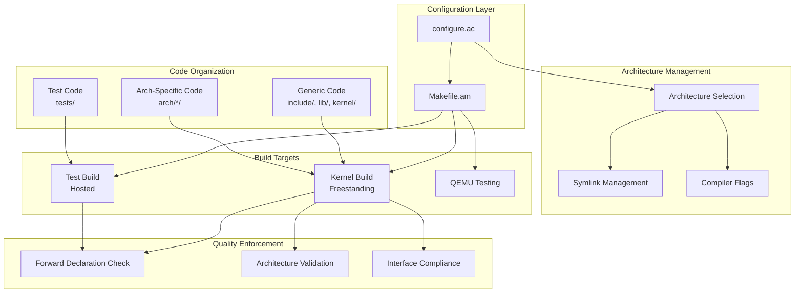

# Build System Design Document

## Overview

The FMI/OS build system implements a comprehensive autoconf/automake-based solution that provides standardized configuration management, multi-architecture support, and automated code quality enforcement. The design emphasizes clean architecture separation, security-first compilation, and seamless cross-compilation while maintaining compatibility with GNU build standards.

The system addresses the complexity of building a modern kernel across multiple architectures (x86_64, ARM64, RISC-V) while enforcing strict code quality standards and providing comprehensive testing integration.

## Architecture

### High-Level Architecture



### Directory Structure Design

The build system enforces a clean directory structure that separates concerns:

```
fmios/
├── configure.ac              # Autoconf configuration
├── Makefile.am              # Top-level automake rules
├── include/                 # Generic headers
│   └── arch -> ../arch/x86_64/include  # Managed symlink
├── lib/                     # Generic libraries
│   ├── arch -> ../arch/x86_64/lib      # Managed symlink
│   └── c/                   # Kernel klibc
├── kernel/                  # Generic kernel code
├── drivers/                 # Generic drivers
├── arch/                    # Architecture-specific code
│   ├── x86_64/
│   │   ├── Makefile.am
│   │   ├── include/
│   │   ├── lib/
│   │   └── drivers/
│   ├── arm64/
│   └── riscv64/
├── tests/                   # Test suite
│   ├── klibc/              # Testing klibc implementation
│   └── unity/              # Unity test framework
└── scripts/                # Build and validation scripts
```

## Components and Interfaces

### Configuration Management Component

**Purpose**: Manages build configuration through autoconf/automake integration

**Key Interfaces**:
- `configure.ac`: Main configuration script with architecture detection
- `Makefile.am` hierarchy: Build rule definitions for each component
- Feature flags: `--enable-*` and `--disable-*` options
- Architecture selection: `--target=*-fmios` options

**Configuration Flow**:
1. Developer runs `./configure --target=x86_64-fmios`
2. Autoconf detects target architecture and sets variables
3. Architecture-specific flags and paths are configured
4. Symlinks are created for architecture selection
5. Makefiles are generated with appropriate rules

### Architecture Separation Component

**Purpose**: Maintains clean separation between generic and architecture-specific code

**Separation Rules**:
- **Generic Code**: No inline assembly, no endian dependencies, portable C only
- **Architecture Code**: May use assembly, endian-specific code, arch intrinsics
- **Interface Consistency**: Architecture code provides uniform interfaces to generic code

**Symlink Management**:
```bash
# Automatic symlink creation during configure
include/arch -> ../arch/$(target_arch)/include
lib/arch -> ../arch/$(target_arch)/lib

# Automatic cleanup during make clean
rm -f include/arch lib/arch
```

### Compiler Flag Management Component

**Purpose**: Applies appropriate compilation flags based on build target and architecture

**Kernel Build Flags**:
```makefile
# Freestanding environment
KERNEL_CFLAGS = -ffreestanding -nostdlib -fno-builtin

# Security mitigations
KERNEL_CFLAGS += -mretpoline -mindirect-branch=thunk-extern
KERNEL_CFLAGS += -fcf-protection=full -fstack-protector-strong

# Bounds checking and overflow detection
KERNEL_CFLAGS += -Warray-bounds -Wstringop-overflow
KERNEL_CFLAGS += -fstack-clash-protection -Wformat-overflow

# Position independence (production vs debug)
KERNEL_CFLAGS += $(PIC_FLAGS)  # -fPIC or -fno-pic
```

**Test Build Flags**:
```makefile
# Hosted environment
TEST_CFLAGS = -D_POSIX_C_SOURCE=200809L

# Debug and development
TEST_CFLAGS += -O0 -g -Wall -Wextra -Werror
```

**Architecture-Specific Flags**:
```makefile
# x86_64 specific
x86_64_CFLAGS = -mcmodel=kernel -mno-red-zone -mno-mmx -mno-sse

# ARM64 specific  
aarch64_CFLAGS = -mcpu=cortex-a57 -mgeneral-regs-only

# RISC-V specific
riscv64_CFLAGS = -march=rv64imac -mabi=lp64
```

### Dual Klibc Strategy Component

**Purpose**: Provides separate kernel and testing C library implementations

**Implementation Strategy**:
- **Single Header Approach**: `lib/c/klibc.h` serves as single source of truth
- **Build System Selection**: Linker flags select appropriate implementation
- **Interface Parity**: Both implementations provide identical function signatures

**Kernel Klibc** (`lib/c/`):
- Compiled with `-ffreestanding -nostdlib`
- Self-contained implementations
- No external dependencies
- Essential functions: kprintf, kmalloc, kfree, etc.

**Testing Klibc** (`tests/klibc/`):
- Compiled without freestanding restrictions
- Wraps standard libc calls
- Identical interface to kernel klibc
- Additional debugging instrumentation

### Code Quality Enforcement Component

**Purpose**: Automatically detects and prevents architectural violations

**Forward Declaration Detection**:
```bash
# Validation script integration
scripts/check-forward-declarations.sh:
- Scans all .c and .h files for forward declarations
- Cross-references with existing headers
- Generates clear error messages with solutions
- Returns non-zero exit code to fail build
```

**Architectural Validation**:
- Detects absolute addresses in generic code
- Validates endian-neutral code in generic files
- Ensures proper include path usage
- Prevents inline assembly in generic code

**Interface Compliance**:
- Validates consistent API usage across modules
- Detects duplicate functionality
- Ensures proper library layering
- Enforces naming convention compliance

## Data Models

### Build Configuration Model

```c
struct build_config_s {
    char target_arch[32];        // x86_64, aarch64, riscv64
    char host_arch[32];          // Host architecture for cross-compilation
    bool enable_debug;           // Debug build configuration
    bool enable_pic;             // Position independent code
    bool enable_serial_console;  // Serial console driver
    bool enable_video_console;   // Video console driver
    bool enable_qemu_testing;    // QEMU smoke tests
    char compiler_flags[1024];   // Accumulated compiler flags
    char linker_flags[1024];     // Accumulated linker flags
    char include_paths[1024];    // Include path configuration
    char library_paths[1024];    // Library path configuration
};
```

### Architecture Configuration Model

```c
struct arch_config_s {
    char name[32];               // Architecture name
    char cflags[512];           // Architecture-specific CFLAGS
    char ldflags[512];          // Architecture-specific LDFLAGS
    char include_dir[256];      // Architecture include directory
    char lib_dir[256];          // Architecture library directory
    bool supports_pic;          // PIC support availability
    bool supports_cet;          // Control Flow Enforcement support
    char asm_constraints[256];  // Assembly constraint requirements
};
```

### Quality Check Model

```c
struct quality_check_s {
    char file_path[512];        // File being checked
    int line_number;            // Line number of violation
    char violation_type[64];    // Type of violation found
    char violation_text[256];   // Actual violating code
    char suggested_fix[256];    // Suggested correction
    char header_to_include[128]; // Header that should be included
};
```

## Correctness Properties

*A property is a characteristic or behavior that should hold true across all valid executions of a system-essentially, a formal statement about what the system should do. Properties serve as the bridge between human-readable specifications and machine-verifiable correctness guarantees.*

Now I need to analyze the acceptance criteria to determine which ones can be tested as properties:

<function_calls>
<invoke name="prework">
<parameter name="featureName">build-system

Based on the prework analysis, I can now identify the key properties that need to be tested. After reviewing all the testable properties, I can consolidate them to eliminate redundancy:

**Property 1: Architecture Configuration Consistency**
*For any* valid target architecture, the build system should set appropriate compiler flags, create correct symlinks, and configure proper include/library paths
**Validates: Requirements 1.3, 2.4, 2.5, 3.3, 3.4**

**Property 2: Build Environment Flag Application**
*For any* kernel source file, freestanding environment flags should be applied, and for any test source file, hosted environment flags should be applied
**Validates: Requirements 4.1, 4.2, 4.3, 4.4**

**Property 3: Position Independence Mode Consistency**
*For any* kernel source file, PIC flags should be applied correctly based on build mode (production vs debug), and all sources should compile successfully in both modes
**Validates: Requirements 5.1, 5.2, 5.3**

**Property 4: Code Quality Validation**
*For any* source file, the build system should detect architectural violations, prevent forward declarations, and enforce proper header usage
**Validates: Requirements 5.4, 5.5, 7.1, 7.2, 7.3, 7.4, 7.5**

**Property 5: Dual Klibc Linking Consistency**
*For any* build target, the correct klibc implementation should be linked (kernel builds use lib/c/, test builds use tests/klibc/), and both implementations should provide identical interfaces
**Validates: Requirements 6.3, 6.4, 6.5**

**Property 6: Feature Configuration Correctness**
*For any* valid feature combination, conditional compilation should work correctly and feature compatibility should be validated
**Validates: Requirements 1.4, 8.4, 8.5**

**Property 7: Cross-Compilation Support**
*For any* valid host/target combination, cross-compilation should configure correctly with appropriate toolchains, paths, and target architecture validation
**Validates: Requirements 9.1, 9.2, 9.3, 9.4**

**Property 8: QEMU Testing Integration**
*For any* QEMU-supported target architecture, testing should work correctly with proper console output capture and validation
**Validates: Requirements 10.4, 10.5**

**Property 9: Memory Layout Management**
*For any* build using memory reclamation, initialization code should be properly isolated, runtime code should not be in reclaimable sections, and appropriate memory layouts should be supported for each target architecture
**Validates: Requirements 11.3, 11.4, 11.5**

**Property 10: Build System Validation**
*For any* build environment, required dependencies should be detected, configuration failures should provide clear error messages, feature/architecture compatibility should be verified, and all configured paths should be correctly established
**Validates: Requirements 12.1, 12.2, 12.3, 12.4, 12.5**

## Error Handling

### Configuration Error Handling

The build system implements comprehensive error detection and reporting:

**Missing Dependencies**:
- Autoconf detects missing tools (compiler, linker, assembler)
- Clear error messages indicate which packages to install
- Graceful fallback for optional dependencies

**Invalid Configuration**:
- Architecture validation prevents unsupported targets
- Feature compatibility checking prevents invalid combinations
- Cross-compilation validation ensures toolchain availability

**Build Failures**:
- Code quality violations fail the build with specific error locations
- Forward declaration detection provides exact file and line numbers
- Architectural violations include suggested fixes

### Runtime Error Recovery

**Symlink Management Failures**:
- Automatic cleanup of partial symlink creation
- Retry mechanisms for filesystem permission issues
- Fallback to absolute paths when symlinks fail

**Compilation Failures**:
- Incremental build support to avoid full rebuilds
- Dependency tracking to rebuild only affected files
- Parallel build support with proper error aggregation

## Testing Strategy

### Dual Testing Approach

The build system requires both unit testing and property-based testing to ensure comprehensive coverage:

**Unit Tests**:
- Specific configuration scenarios (e.g., x86_64 target selection)
- Individual feature flag testing (e.g., --enable-debug)
- Specific build target validation (e.g., make clean)
- Error condition testing (e.g., missing dependencies)

**Property-Based Tests**:
- Universal properties across all target architectures
- Configuration consistency across all valid feature combinations
- Code quality validation across all source files
- Cross-compilation correctness across all host/target pairs

### Property-Based Testing Configuration

Each property test should run a minimum of 100 iterations to ensure comprehensive coverage through randomization. The tests will use the following configuration:

**Test Framework**: Custom build system testing framework integrated with Unity
**Iteration Count**: 100 minimum per property test
**Input Generation**: 
- Random target architecture selection from supported set
- Random feature flag combinations within compatibility constraints
- Random source file selection for code quality testing
- Random host/target combinations for cross-compilation testing

**Property Test Tags**:
- **Feature: build-system, Property 1**: Architecture Configuration Consistency
- **Feature: build-system, Property 2**: Build Environment Flag Application
- **Feature: build-system, Property 3**: Position Independence Mode Consistency
- **Feature: build-system, Property 4**: Code Quality Validation
- **Feature: build-system, Property 5**: Dual Klibc Linking Consistency
- **Feature: build-system, Property 6**: Feature Configuration Correctness
- **Feature: build-system, Property 7**: Cross-Compilation Support
- **Feature: build-system, Property 8**: QEMU Testing Integration
- **Feature: build-system, Property 9**: Memory Layout Management
- **Feature: build-system, Property 10**: Build System Validation

### Testing Integration

**Build System Self-Testing**:
- The build system tests itself during configuration
- Validation scripts run as part of the build process
- Continuous integration runs full test suite on all supported architectures

**QEMU Integration Testing**:
- Automated kernel builds and testing in QEMU virtual machines
- Console output capture and validation
- Multi-architecture testing pipeline

**Code Quality Continuous Validation**:
- Forward declaration checking on every build
- Architectural violation scanning
- Interface compliance verification