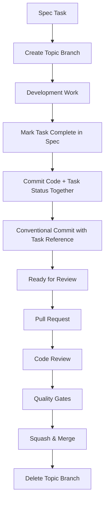

# Design Document

## Overview

The Git workflow integration provides a structured approach to version control that aligns with FMI/OS spec-driven development. The design implements topic branches for task isolation, conventional commits for standardized history, and practical automation tooling for workflow enforcement using a single repository model.

## Architecture

### Single Repository Structure

The FMI/OS project uses a single repository structure:
- **Main Repository** (`fmios/`): Contains the kernel code, build system, implementation, and specifications in `.kiro/` subdirectory
- **Specifications**: Located in `.kiro/specs/` within the main repository
- **Task Status**: Managed through manual updates in spec files, enforced by Kiro steering rules

### Workflow Components



### Branch Naming Convention

Topic branches follow the pattern: `{spec-name}/{task-number}-{brief-description}`

Examples:
- `memory/2.1-implement-slab-allocator`
- `console/1.3-add-serial-driver`
- `build-system/3.2-configure-cross-compilation`

### Conventional Commit Format

All commits must follow conventional commit specification:

```
{type}({scope}): {description}

{optional body}

Task: {spec-name}#{task-number}
```

#### Commit Types
- **feat**: New feature implementation
- **fix**: Bug fixes
- **docs**: Documentation changes
- **style**: Code style changes (formatting, etc.)
- **refactor**: Code refactoring without feature changes
- **test**: Adding or modifying tests
- **chore**: Maintenance tasks
- **build**: Build system changes
- **ci**: CI/CD configuration changes

#### Scope Examples
- Spec names: `memory`, `console`, `build-system`
- Subsystems: `slab`, `scheduler`, `ipc`
- Components: `tests`, `docs`, `scripts`

## Components and Interfaces

### Git Hook System

#### Pre-commit Hook
```bash
#!/bin/bash
# Validates:
# - Conventional commit format
# - GPL v2 license headers in new files
# - Code style compliance
# - Test execution for modified code
```

#### Commit-msg Hook
```bash
#!/bin/bash
# Validates:
# - Conventional commit message format
# - Task reference in footer
# - Task exists in corresponding spec file
```

#### Pre-push Hook
```bash
#!/bin/bash
# Validates:
# - All commits follow conventional format
# - Branch name follows naming convention
# - No direct pushes to main/master
```

### Branch Management Scripts

#### create-topic-branch.sh
```bash
#!/bin/bash
# Usage: create-topic-branch.sh <spec-name> <task-number> <description>
# Creates properly named topic branch
# Validates task exists in spec
# Sets up branch tracking
```

#### prepare-merge.sh
```bash
#!/bin/bash
# Interactive script for merge preparation:
# - Reviews commits for squashing
# - Validates conventional commit format
# - Checks task completion status
# - Creates pull request template
```

### Task Status Integration

#### Steering Rule Enforcement
The task completion workflow is enforced through a Kiro steering rule that requires:
- Manual task status updates in spec files
- Atomic commits including both implementation and task status changes
- Conventional commit format with task references

#### Task Completion Workflow
1. Complete task implementation
2. Manually update task status in .kiro/specs/{spec}/tasks.md
3. Stage all changes (implementation + task status): `git add .`
4. Commit with conventional format and task reference

## Data Models

### Branch Metadata
```yaml
branch:
  name: "memory/2.1-implement-slab-allocator"
  spec: "memory"
  task: "2.1"
  description: "implement-slab-allocator"
  status: "in_progress"
  created: "2024-12-24T10:30:00Z"
  author: "developer@example.com"
```

### Commit Metadata
```yaml
commit:
  hash: "abc123def456"
  type: "feat"
  scope: "memory"
  description: "implement slab allocator core functionality"
  task_reference: "memory#2.1"
  conventional_format: true
  license_compliant: true
```

### Task Status Metadata
```yaml
task:
  spec: "memory"
  number: "2.1"
  description: "Implement slab allocator core functionality"
  status: "completed"
  completed_date: "2024-12-24T15:30:00Z"
```

### Pull Request Template
```markdown
## Task Reference
Task: {spec-name}#{task-number}

## Description
Brief description of changes

## Acceptance Criteria Checklist
- [ ] Criterion 1 from spec
- [ ] Criterion 2 from spec
- [ ] All tests pass
- [ ] Code follows style guidelines
- [ ] GPL v2 license headers added to new files

## Type of Change
- [ ] feat: New feature
- [ ] fix: Bug fix
- [ ] docs: Documentation
- [ ] refactor: Code refactoring
- [ ] test: Test changes
```

## Validation Approach

### Basic Validation Properties

The workflow enforces several key properties through Git hooks and scripts:

1. **Branch Name Format**: Topic branches must follow `{spec-name}/{task-number}-{brief-description}` pattern
2. **Conventional Commits**: All commits must follow conventional commit format with proper task references
3. **Branch Protection**: Direct commits to main/master branch are prevented
4. **License Compliance**: New files must include GPL v2 license headers
5. **Task Traceability**: Commits must reference valid tasks from existing spec files

### Validation Methods

- **Git Hooks**: Pre-commit, commit-msg, and pre-push hooks enforce workflow rules
- **Script Validation**: Branch creation and management scripts validate inputs
- **Manual Review**: Pull request process ensures code quality and task completion
- **Steering Rules**: Kiro enforces proper task status updates with implementation commits

## Error Handling

### Git Hook Failures
- **Pre-commit failures**: Provide clear error messages indicating which validation failed
- **Commit-msg failures**: Show examples of correct conventional commit format
- **Pre-push failures**: Explain branch naming or protection violations

### Branch Creation Errors
- **Invalid task reference**: Display available tasks from the specified spec
- **Duplicate branch name**: Suggest alternative naming or check existing branches
- **Missing spec**: List available specs and their current tasks

### Merge Conflicts
- **Rebase conflicts**: Provide step-by-step resolution guidance
- **Squash conflicts**: Offer interactive conflict resolution tools
- **Pull request conflicts**: Require rebase before allowing merge

### License Compliance Errors
- **Missing headers**: Automatically add GPL v2 headers where possible
- **Incorrect headers**: Show diff between current and required header format
- **New file detection**: Scan all staged files for license compliance

## Testing Strategy

### Unit Testing
- **Git hook scripts**: Test each hook with valid and invalid inputs
- **Branch creation scripts**: Verify proper branch naming and validation
- **Commit message parsing**: Test conventional commit format validation
- **License header detection**: Verify GPL v2 header recognition and insertion

### Integration Testing
- **End-to-end workflow**: Complete task lifecycle from branch creation to merge
- **Git hook integration**: Verify hooks work correctly with Git operations
- **Build system integration**: Verify tools work with existing build processes
- **Spec file updates**: Test manual task status update workflow

### Manual Testing Scenarios
- **Branch creation**: Test create-topic-branch.sh with various inputs
- **Commit validation**: Test commit-msg hook with various commit formats
- **Pull request workflow**: Verify PR creation and review process
- **License compliance**: Test pre-commit hook with files missing headers

## Implementation Notes

### Git Configuration Requirements
```bash
# Required Git configuration for conventional commits
git config --global commit.template .gitmessage
git config --global core.hooksPath .githooks
git config --global branch.autosetupmerge always
git config --global branch.autosetuprebase always
```

### Directory Structure
```
.githooks/
├── pre-commit           # Validates code style, tests, license headers
├── commit-msg          # Validates conventional commit format
├── pre-push            # Validates branch names, prevents direct pushes
└── post-merge          # Updates task status after merge

scripts/git-workflow/
├── create-topic-branch.sh    # Branch creation automation
├── prepare-merge.sh          # Pre-merge validation and cleanup
├── update-task-status.sh     # Task status synchronization
└── validate-commit.sh        # Commit message validation

templates/
├── .gitmessage              # Commit message template
├── pull-request-template.md # PR template with task references
├── gpl-v2-header.txt       # GPL v2 license header template
├── .gitignore              # Standard ignore patterns
├── README.md               # Project README template
└── LICENSE.md              # GPL v2 license text

.editorconfig                # EditorConfig for consistent coding style
.gitignore                   # Repository ignore file
README.md                    # Project documentation
LICENSE.md                   # GPL v2 license file
```

### EditorConfig Configuration
```ini
# .editorconfig - Enforces consistent coding style across all editors
root = true

# C source files: tabs, 8-character indentation
[*.{c,h}]
indent_style = tab
indent_size = 8
max_line_length = 100

# Assembly files: tabs, 8-character indentation
[*.{s,S}]
indent_style = tab
indent_size = 8

# Shell scripts: tabs, 8-character indentation
[*.{sh,bash}]
indent_style = tab
indent_size = 8

# Makefiles: tabs (required by make)
[{Makefile*,*.mk,*.am}]
indent_style = tab
indent_size = 8

# Documentation: 2 spaces, 80 char lines
[*.md]
indent_style = space
indent_size = 2
max_line_length = 80
```

### Standard .gitignore Content
```gitignore
# IDE and Editor directories
.vscode/
.idea/
*.swp
*.swo
*~

# Build artifacts
*.o
*.a
*.so
*.dylib
*.exe
build/
dist/
*.log

# OS generated files
.DS_Store
.DS_Store?
._*
.Spotlight-V100
.Trashes
ehthumbs.db
Thumbs.db

# Temporary files
*.tmp
*.temp
*.bak
*.backup

# Autotools generated files
autom4te.cache/
config.log
config.status
configure
Makefile.in
Makefile
aclocal.m4

# Testing artifacts
*.gcov
*.gcda
*.gcno
coverage/
test-results/
```

### README.md Structure
```markdown
# FMI/OS - Microkernel Operating System

## Overview
Brief description of FMI/OS architecture and goals

## Building
Instructions for building the kernel using autoconf/automake

## Testing
How to run unit tests and QEMU smoke tests

## Contributing
- Spec-driven development process
- Git workflow with topic branches
- Conventional commit format
- Code review requirements

## License
This project is licensed under GPL v2 - see LICENSE.md for details
```

### LICENSE.md Content
```markdown
# GNU General Public License v2.0

Copyright (C) [YEAR] [COPYRIGHT HOLDER]

This program is free software; you can redistribute it and/or modify
it under the terms of the GNU General Public License as published by
the Free Software Foundation; version 2 of the License.

This program is distributed in the hope that it will be useful,
but WITHOUT ANY WARRANTY; without even the implied warranty of
MERCHANTABILITY or FITNESS FOR A PARTICULAR PURPOSE.  See the
GNU General Public License for more details.

[Full GPL v2 license text]
```

### Integration Points
- **Spec task tracking**: Reads and updates tasks.md files
- **Build system**: Integrates with autoconf/automake build process
- **Testing framework**: Triggers tests for modified code
- **CI/CD pipeline**: Provides hooks for continuous integration

This design ensures that the Git workflow supports the spec-driven development process while maintaining clean, traceable, and compliant code history.

<function_calls>
<invoke name="prework">
<parameter name="featureName">git-workflow